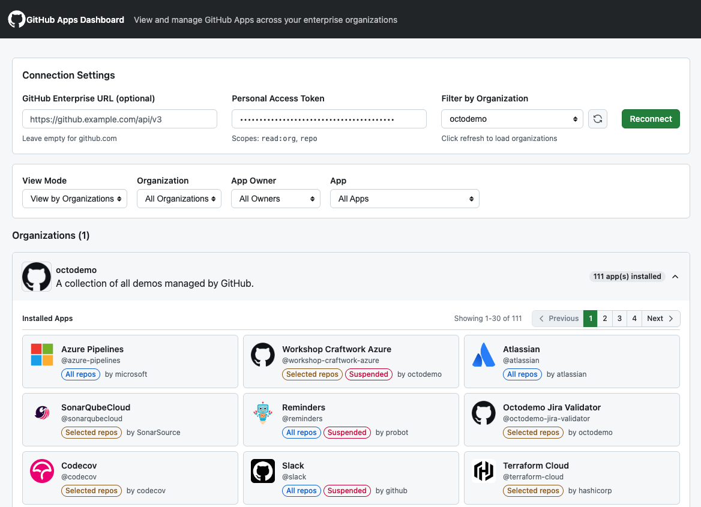

# GitHub Apps Dashboard

> ⚠️ **Important**: this app was 100% vibe-coded in a few hours using [GitHub Copilot CLI](https://github.com/github/copilot-cli) and Claude Opus 4.5.

[](https://opensource.org/licenses/MIT)
[](https://nodejs.org/)
[](https://www.typescriptlang.org/)
[](https://react.dev/)

## 🚀 [Try it now → gateixeira.github.io/github-apps-dashboard](https://gateixeira.github.io/github-apps-dashboard/)

A client-only web application to view and manage GitHub Apps installed across your GitHub Enterprise organizations. Get visibility into which apps have access to your repositories and organizations.

**🔒 Security First**: This is a **client-only application** - your Personal Access Token never leaves your browser. All GitHub API calls are made directly from the browser to GitHub's API, and no token is ever stored or transmitted to any server.



## ✨ Features

- **🔍 View by Apps** - See all GitHub Apps installed across your organizations, with expandable details showing installations, permissions, events, and repository access
- **🏢 View by Organizations** - Browse organizations and see all apps installed in each one with pagination support
- **📁 View by Repositories** - Two-column layout showing repositories on the left and app access details on the right
- **🎯 Powerful Filtering** - Filter by organization, app owner, and specific apps
- **📊 App Usage Detection** - Identify inactive apps by analyzing audit logs to find apps with no recent activity
- **🔒 Repository Access** - View all repositories an app has access to, with visibility indicators
- **📊 Pagination** - Handle large numbers of apps and installations efficiently
- **🌙 Dark Mode** - Toggle between light and dark themes
- **🎨 GitHub-Styled UI** - Built with [Primer React](https://primer.style/react/) for a native GitHub look and feel

## 📋 Table of Contents

- [Prerequisites](#prerequisites)
- [Quick Start](#quick-start)
- [Deployment](#deployment)
- [Usage](#usage)
- [Architecture](#architecture)
- [Contributing](#contributing)
- [Security](#security)
- [License](#license)

## 🔧 Prerequisites

- **Node.js 18+** - [Download](https://nodejs.org/) (for development only)
- **npm** or **yarn** - Comes with Node.js
- **GitHub Personal Access Token** with the following scopes:
  - `read:org` - To list organizations and their app installations
  - `repo` - To access repository information
  - `admin:org` or `read:audit_log` - (Optional) To detect app usage via audit logs

## 🚀 Quick Start

### 1. Clone the repository

```bash
git clone https://github.com/gateixeira/github-apps-dashboard.git
cd github-apps-dashboard
```

### 2. Install dependencies

```bash
npm install
```

### 3. Start the development server

```bash
npm run dev
```

### 4. Open your browser

Navigate to [http://localhost:5173](http://localhost:5173)

## 🌐 Deployment

Since this is a **client-only application**, you can deploy it as static files to any web hosting service.

### Build for Production

```bash
npm run build
```

The built files will be in `dist/`. These can be deployed to:

- **GitHub Pages**
- **Netlify**
- **Vercel**
- **AWS S3 + CloudFront**
- **Azure Static Web Apps**
- **Any static file server (nginx, Apache, etc.)**

### Example: Deploy to GitHub Pages

```bash
# Build the app
npm run build

# Deploy to gh-pages branch
npx gh-pages -d dist
```

## 📖 Usage

### Getting Started

1. Open the application in your browser
2. Enter your GitHub Enterprise URL (leave empty for github.com)
3. Enter your Personal Access Token with required scopes
4. Select an organization (required)
5. Click **Connect** to load your data

### View Modes

#### Apps View
Shows all GitHub Apps grouped by app. Click on an app to expand and see:
- Description (rendered as Markdown) and owner information
- All organizations where the app is installed
- Repository access (all repos vs. selected repos)
- Permissions and subscribed events
- List of accessible repositories

#### Organizations View
Shows all organizations with their installed apps:
- Expand an organization to see all installed apps
- Pagination support for organizations with many apps
- Quick view of app access levels (All repos / Selected repos)

#### Repositories View
Two-column layout for repository-centric exploration:
- **Left panel**: Scrollable list of repositories with private/public indicators
- **Right panel**: Selected repository details with list of apps that have access

### Filtering Options

| Filter | Description |
|--------|-------------|
| **App Owner** | Filter apps by their owner (organization or user) |
| **App** | Filter to show a specific app across all organizations |
| **Activity** | Show all apps, only active, or only inactive apps |

### App Usage Detection

The dashboard can identify potentially unused apps by analyzing organization audit logs:

- **Active** (green) - App has activity in audit logs within the last 90 days
- **Inactive** (red) - No activity found in audit logs within the threshold period
- **Unknown** (gray) - Could not determine activity (e.g., no audit log access)

This feature requires the `admin:org` or `read:audit_log` scope on your Personal Access Token.

## 🏗️ Architecture

This is a **client-only application** - there is no backend server. All GitHub API calls are made directly from your browser using the [Octokit](https://github.com/octokit/rest.js) library.

```
github-apps-dashboard/
├── src/
│   ├── components/   # React components
│   ├── hooks/        # Custom React hooks
│   ├── services/     # GitHub API client (Octokit wrapper)
│   └── types/        # TypeScript types
├── public/           # Static assets
├── index.html        # Entry HTML file
├── package.json
└── README.md
```

### Technology Stack

| Layer | Technology |
|-------|------------|
| **API Client** | [@octokit/rest](https://github.com/octokit/rest.js) |
| **Frontend** | React 19, TypeScript, [Vite](https://vitejs.dev/) |
| **UI Components** | [Primer React](https://primer.style/react/), styled-components |
| **Styling** | CSS Variables with GitHub Primer design tokens |

### Security Model

```
┌─────────────────────────────────────────────────────────────────┐
│                        Your Browser                             │
├─────────────────────────────────────────────────────────────────┤
│  React App (client-only)                                        │
│  ┌─────────────────┐    ┌─────────────────────────────────────┐ │
│  │  Token stays    │───▶│  Direct HTTPS calls to GitHub API  │ │
│  │  in browser     │    │  (api.github.com or enterprise)    │ │
│  └─────────────────┘    └─────────────────────────────────────┘ │
└─────────────────────────────────────────────────────────────────┘
                                    │
                                    ▼
                    ┌───────────────────────────────┐
                    │     GitHub API (CORS enabled) │
                    │     - Organizations           │
                    │     - Installations           │
                    │     - Apps                    │
                    │     - Audit Logs              │
                    └───────────────────────────────┘
```

**Key security properties:**
- ✅ Token never leaves the browser
- ✅ No server to compromise
- ✅ No token storage (session only)
- ✅ Read-only operations only
- ✅ All requests go directly to GitHub over HTTPS

## 🤝 Contributing

Contributions are welcome! Please feel free to submit a Pull Request.

### Development Setup

1. Fork the repository
2. Create your feature branch (`git checkout -b feature/amazing-feature`)
3. Make your changes
4. Run the linter and tests
5. Commit your changes (`git commit -m 'Add some amazing feature'`)
6. Push to the branch (`git push origin feature/amazing-feature`)
7. Open a Pull Request

### Code Style

- Use TypeScript for all new code
- Follow the existing code style
- Add comments for complex logic
- Update documentation as needed

### Reporting Issues

Found a bug or have a feature request? Please [open an issue](https://github.com/gateixeira/github-apps-dashboard/issues/new) with:

- A clear description of the issue
- Steps to reproduce (for bugs)
- Expected vs actual behavior
- Screenshots if applicable

## 🔒 Security

### Token Handling

- Personal Access Tokens are **never stored** - they exist only in browser memory during your session
- Tokens are **never transmitted to any server** - all API calls go directly from browser to GitHub
- Closing your browser tab clears the token from memory

### Why Client-Only?

The client-only architecture provides maximum security:

1. **No server to compromise** - There's no backend that could be hacked to steal tokens
2. **No token transmission** - Your token goes directly to GitHub, never to a third party
3. **No storage** - Tokens exist only in memory and are cleared when you close the tab
4. **Open source** - You can inspect exactly what the code does with your token

### Reporting Security Vulnerabilities

If you discover a security vulnerability, please send an email to the repository owner instead of opening a public issue.

## 📄 License

This project is licensed under the MIT License - see the [LICENSE](LICENSE) file for details.

## 🙏 Acknowledgments

- [GitHub](https://github.com) for the amazing API and platform
- [Primer](https://primer.style/) for the design system
- [Octokit](https://github.com/octokit) for the excellent GitHub API client

---

<p align="center">
  Made with ❤️ by <a href="https://github.com/gateixeira">@gateixeira</a>
</p>
